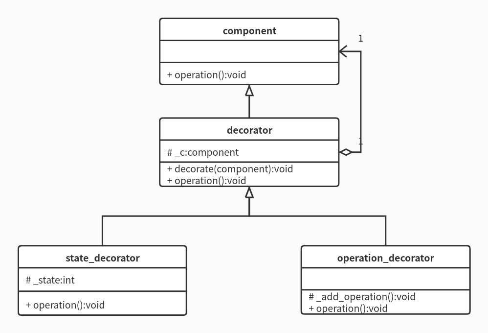

# Design-Pattern-Cpp
Design pattern demo   

## UML类图易混淆知识点
### 类间关系——依赖与关联
依赖关系表现为：某类是其他类内部成员的参数或局部变量或返回值;   
关联关系表现为：某类是其他类的属性。

## 创建型设计模式
### Static Factory(静态工厂模式)
#### 特点  
由静态工厂对子类进行实例化;   
并且判断对哪个子类进行实例化也是静态工厂的职责（该特点会破坏“开放-封闭”原则，因为若想新增子类，将不得不修改静态工厂类的代码）。
#### UML类图

### Factory Method(工厂方法模式)
#### 特点
由工厂类对子类进行实例化;但判断对哪个子类进行实例化是用户的责任，工厂类只负责生产具体的子类实例，符合“开放-封闭”原则。   
（具体来说，若想新增子类，只需让新增该子类的具体工厂类，即新增一个继承自工厂类、与新增子类匹配的具体工厂类，无需修改工厂类代码，符合“开放-封闭”原则。）
#### UML类图

### Abstract Factory(抽象工厂模式)
#### 特点
工厂可以生产抽象对象的不同子类实例。
#### UML类图

### Prototype(原型模式)
#### 特点
产生对象的拷贝（浅拷贝或深拷贝）。
#### 与拷贝构造函数/移动构造函数的区别
对于某类来说，它的拷贝构造函数/移动构造函数只能对与当前类严格同类型的对象进行操作；  
而原型模式中，拷贝方法继承自抽象原型，可以利用多态，允许通过当前子类对父类其他子类实例进行操作。   
#### UML类图

### Builder(创建者模式)
#### 特点
分离对象的构造和表示，重定义同一构造过程的表示。通过Director隐藏实际的构造过程。
#### 与直接多态的区别
直接多态的构造和表示是一体的，而创建者模式可以单独重定义表示过程。
#### UML类图

### Singleton(单例模式)
#### 特点
使类只能实例化一个对象。
#### UML类图

## 结构型设计模式
### Decorate(装饰模式)    
#### 目的   
使某一对象在运行时可被动态的添加职责。   
#### 与继承的区别
继承也是为对象添加职责，但继承是在编译器完成这一任务的;而装饰模式可将其推迟到运行时。   
#### UML类图
   
### Proxy(代理模式)    
#### 目的   
为其他对象提供一种代理，以代理来控制对该对象的访问。   
#### 最典型的应用——引用计数
例如C++11标准引入的std::shared_ptr。    
#### UML类图

### Facade（外观模式）
#### 目的
为系统中的一组类提供一个一致的接口，简化系统的使用。
#### UML类图

### Adapter（适配器模式）
#### 目的
将不匹配当前目标接口的类适配为匹配目标接口的类。典型应用如std::stack,std::queue等。
#### UML类图

### Combination（组合模式）
#### 目的
着重体现整体与部分的关系，整体与部分采用树形结构，用户可以忽略组合对象与单个对象的区别。
#### UML类图

### Bridge（桥梁模式）
#### 目的
分离抽象与实现。
#### UML类图

## 行为型设计模式
### Stretegy(策略模式)    
#### 目的   
使得算法（策略）的变化不会影响到该算法的用户。    
#### 与静态工厂的区别
1、静态工厂模式中，工厂无需持有具体产品的引用;   
而策略模式中，使用算法（策略）的上下文（Context）需要持有具体算法类的引用，以调用具体算法来实现目的。   
2、上述内容从UML类图上看，就是静态工厂方法中工厂与抽象产品间为依赖关系，而策略模式中上下文与抽象算法间为聚合关系。 
#### UML类图
    
### Template Method（模板方法模式）
#### 目的
以相同的框架调用不同的子系统，不改变算法结构即可重定义其中的某些步骤。
#### 与C++中的模板的区别
很明显完全不同好么.....
#### UML类图
   
### Observer(观察者模式)
#### 特点
定义了一对多的依赖。让多个观察者监视同一个主题对象，当主题对象状态发生改变时，通知所有观察者让它们自己更新自己。   
#### 使用时机
一个对象需要改变其他对象，但它又不知道到底需要改变多少个对象的时候。
#### UML类图

### State(状态模式)
#### 特点
将状态的转移作为类来实现， 简化了分支判断，允许在运行时进行状态转移。
#### UML类图

### Memento（备忘录模式）
#### 目的
保存目标对象的内部状态，以方便某一时刻目标对象恢复其之前的内部状态。
#### UML类图

### Iterator（迭代器模式）
#### 目的
遍历某个对象集合而不暴露具体的遍历细节。典型应用如std中的各种容器等。
#### UML类图

